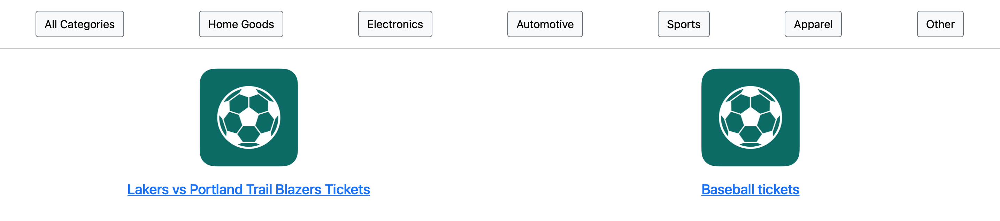

# Want To Buy
  Want To Buy (WTB) was designed to put buyers front and center, letting them create posts of what they want. Sellers can contact a buyer via email if they have an item that matches the buyer's description and price. Visit WTB at https://want-to-buy.herokuapp.com/. 

  ## Table of Contents
  - [User Story](#userstory)
  - [About](#about)
  - [Technologies](#technologies)
  - [Authors](#authors)
  
  ## User Story

  AS a Buyer I want a place to make a post of an item I “want to buy”.
 
WHEN I login I can make a post, add a description, select a category, and add a price I'm willing to pay for the listed item.
 
THEN a Seller is able to contact me via my registered email to continue the transaction.

  ## About

  ### Technologies
  - Node.js, Express,js, bcrypt and dotenv to create a RESTful API
  - Handlebars.js as the the templating engine
  - MySQL and the Sequelize ORM for the database
  - Amazon Web Services S3 for storing image icons
  - Deployed using Heroku with data

  ### Features
  
  **Login**
  

  **Category Filters (Pictured below is the Home Goods filter at work)**

  **Create New Listing**
  

  **Edit Listing**
  

  **Search & Search Results**
  
  
  
  ### Authors
  - [Taylor Keltgen](https://github.com/taylorkeltgen/want-to-buy)
  - [Zak Krutikov](https://github.com/zkrutikov)
  - [Kevin Aboy](https://github.com/kevinaboy) 
  - [Roshaad Johnson](https://github.com/Roshaadj)